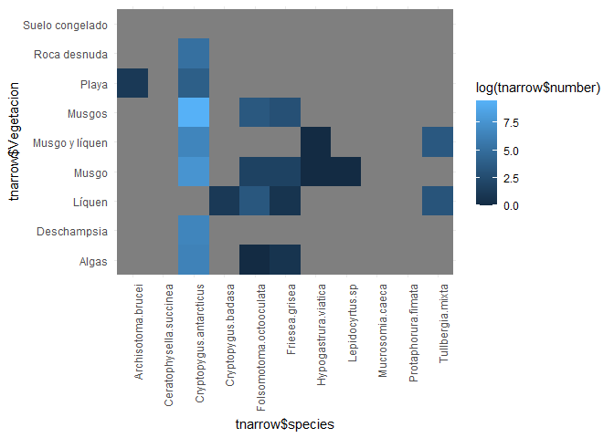
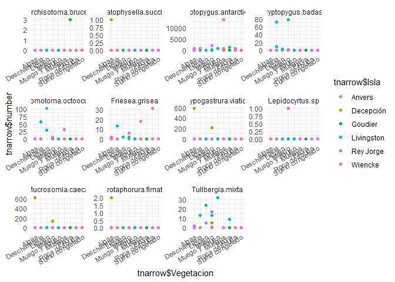
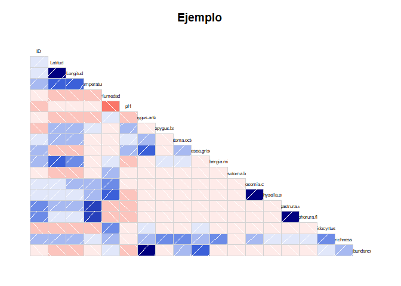
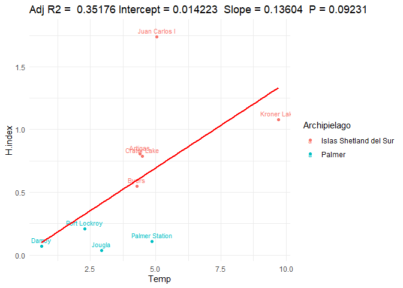
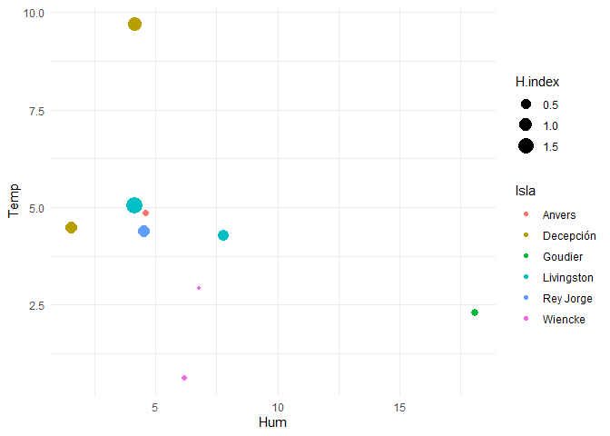

``` r
#install.package("")
library(ggplot2)
library(ggmap)
```

    ## Google's Terms of Service: https://cloud.google.com/maps-platform/terms/.

    ## Please cite ggmap if you use it! See citation("ggmap") for details.

``` r
library(corrgram)
```

    ## Registered S3 method overwritten by 'seriation':
    ##   method         from 
    ##   reorder.hclust gclus

``` r
library(tidyr)
library(plyr)
```

    ## 
    ## Attaching package: 'plyr'

    ## The following object is masked from 'package:corrgram':
    ## 
    ##     baseball

``` r
library(dplyr)
```

    ## 
    ## Attaching package: 'dplyr'

    ## The following objects are masked from 'package:plyr':
    ## 
    ##     arrange, count, desc, failwith, id, mutate, rename, summarise,
    ##     summarize

    ## The following objects are masked from 'package:stats':
    ## 
    ##     filter, lag

    ## The following objects are masked from 'package:base':
    ## 
    ##     intersect, setdiff, setequal, union

``` r
library(Rmisc)
```

    ## Loading required package: lattice

    ## 
    ## Attaching package: 'lattice'

    ## The following object is masked from 'package:corrgram':
    ## 
    ##     panel.fill

``` r
#Read csv
tabla <-  read.csv("data/rawdata.csv",sep=";",dec = ".") %>% 
  as_tibble()

x<-tabla %>% select(12:22)

#Calculo de la riqueza por muestra
tabla$richness <- apply(x, 1, function(i) sum(i > 0))
#Calculo de la abundancia por muestra
tabla <- tabla  %>% 
  mutate(abundance = rowSums(.[12:22]))
```

La tabla contiene nuestros datos y medidas por cada una de las muestras.
Por ejemplo en cada punto se tomaron entre 3 y 5 muestras. Cada muestra
tiene variables fisico-quimicas asociadas.

``` r
tabla %>% 
  head()
```

    ## # A tibble: 6 x 24
    ##      ID Archipielago Isla  Punto Vegetacion Fecha Latitud Longitud Temperatura
    ##   <int> <fct>        <fct> <fct> <fct>      <fct>   <dbl>    <dbl>       <dbl>
    ## 1     1 Islas Shetl~ Rey ~ Arti~ Playa      11/0~   -62.2    -58.9         2.2
    ## 2     2 Islas Shetl~ Rey ~ Arti~ Musgo      11/0~   -62.2    -58.9         6.6
    ## 3     3 Islas Shetl~ Rey ~ Arti~ Algas      11/0~   -62.2    -58.9        NA  
    ## 4     4 Islas Shetl~ Rey ~ Arti~ Líquen     11/0~   -62.2    -58.9        NA  
    ## 5     1 Islas Shetl~ Dece~ Kron~ Musgo      12/0~   -63.0    -60.6        10.7
    ## 6     2 Islas Shetl~ Dece~ Kron~ Musgo      12/0~   -63.0    -60.6         8.3
    ## # ... with 15 more variables: Humedad <dbl>, pH <dbl>,
    ## #   Cryptopygus.antarcticus <int>, Cryptopygus.badasa <int>,
    ## #   Folsomotoma.octooculata <int>, Friesea.grisea <int>,
    ## #   Tullbergia.mixta <int>, Archisotoma.brucei <int>, Mucrosomia.caeca <int>,
    ## #   Ceratophysella.succinea <int>, Hypogastrura.viatica <int>,
    ## #   Protaphorura.fimata <int>, Lepidocyrtus.sp <int>, richness <int>,
    ## #   abundance <dbl>

Ahora podemos resumir nuestra tabla por punto en vez de por muestra. Las
variables de cada punto seran las medias de cada muestra, o las sumas de
cada especie por muestra. Las riquezas y abundancias se suman por
muestra para obtener la total para cada punto.

``` r
#group_by Punto and summarize
tabla2 <- tabla %>% 
  ungroup() %>% 
  group_by(Archipielago,Isla,Punto) %>%
  summarise(Lat=mean(Latitud),
            Long=mean(Longitud),
            Temp=mean(Temperatura,na.rm = T),
            Hum=mean(Humedad,na.rm = T),
            pH=mean(pH,na.rm=T),
            C.ant=sum(Cryptopygus.antarcticus),
            C.bad=sum(Cryptopygus.badasa),
            F.oct=sum(Folsomotoma.octooculata),
            F.gri=sum(Friesea.grisea),
            T.mix=sum(Tullbergia.mixta),
            A.bru=sum(Archisotoma.brucei),
            M.cae=sum(Mucrosomia.caeca),
            C.suc=sum(Ceratophysella.succinea),
            H.via=sum(Hypogastrura.viatica),
            P.fil=sum(Protaphorura.fimata),
            L.sp=sum(Lepidocyrtus.sp),
            Abun=sum(abundance),
            richness=sum(richness))
```

Echa un vistazo a la tabla2.

``` r
tabla2 %>% 
  head()
```

    ## # A tibble: 6 x 21
    ## # Groups:   Archipielago, Isla [4]
    ##   Archipielago Isla  Punto   Lat  Long  Temp   Hum    pH C.ant C.bad F.oct F.gri
    ##   <fct>        <fct> <fct> <dbl> <dbl> <dbl> <dbl> <dbl> <int> <int> <int> <int>
    ## 1 Islas Shetl~ Dece~ Crat~ -63.0 -60.7  4.5   1.55  6.25   130     0    11     0
    ## 2 Islas Shetl~ Dece~ Kron~ -63.0 -60.6  9.7   4.14  6.4     11     0     0     0
    ## 3 Islas Shetl~ Livi~ Byers -62.7 -61.1  4.28  7.78  6.02  2253    76    32     4
    ## 4 Islas Shetl~ Livi~ Juan~ -63.0 -60.4  5.05  4.15  6.65   119    86    59    14
    ## 5 Islas Shetl~ Rey ~ Arti~ -62.2 -58.9  4.4   4.5   5.75     0     0   102     2
    ## 6 Palmer       Anve~ Palm~ -64.8 -64.1  4.86  4.6   6.26  2111     0     0    31
    ## # ... with 9 more variables: T.mix <int>, A.bru <int>, M.cae <int>,
    ## #   C.suc <int>, H.via <int>, P.fil <int>, L.sp <int>, Abun <dbl>,
    ## #   richness <int>

Ahora podemos calcular la riqueza para cada punto. Esta riqueza es
distinta de la suma de riquezas de las muestras.

``` r
t <- tabla2
  
#Calculo de la riqueza por Punto
riq <- apply(t[,9:19], 1, function(i) sum(i > 0))

t$riqueza <- riq
```

Calculo de diversidad para cada punto

``` r
#Seleccionamos las columnas de las especies
tabla.sp <- t %>% ungroup() %>% select(9:19) 

#filas son observaciones (I=9) y columnas son especies (J=11)
tablap <- matrix(0, nrow = 9,ncol = 11) %>%  #Matriz vacia 9x11 
  as.data.frame()

for (i in 1:9){
  for (j in 1:11){
    tablap[i,j]=tabla.sp[i,j]/sum(tabla.sp[i,])
  }
}

for (i in 1:11){
  colnames(tablap)[i]=paste0("pi_",colnames(tabla.sp)[i])
}

#Tabla p representa la proporcion de las especies sobre la abundancia total por fila (~punto)
tablap
```

    ##      pi_C.ant   pi_C.bad    pi_F.oct    pi_F.gri     pi_T.mix   pi_A.bru
    ## 1 0.860927152 0.00000000 0.072847682 0.000000000 0.0331125828 0.00000000
    ## 2 0.006962025 0.00000000 0.000000000 0.000000000 0.0006329114 0.00000000
    ## 3 0.916971917 0.03093203 0.013024013 0.001628002 0.0370370370 0.00000000
    ## 4 0.428057554 0.30935252 0.212230216 0.050359712 0.0000000000 0.00000000
    ## 5 0.000000000 0.00000000 0.796875000 0.015625000 0.1875000000 0.00000000
    ## 6 0.985527544 0.00000000 0.000000000 0.014472456 0.0000000000 0.00000000
    ## 7 0.967032967 0.00000000 0.000000000 0.000000000 0.0000000000 0.03296703
    ## 8 0.993113625 0.00000000 0.002951303 0.002951303 0.0000000000 0.00000000
    ## 9 0.996390894 0.00000000 0.002220988 0.001388118 0.0000000000 0.00000000
    ##    pi_M.cae     pi_C.suc     pi_H.via    pi_P.fil      pi_L.sp
    ## 1 0.0000000 0.0000000000 0.0331125828 0.000000000 0.0000000000
    ## 2 0.4879747 0.0006329114 0.5025316456 0.001265823 0.0000000000
    ## 3 0.0000000 0.0000000000 0.0004070004 0.000000000 0.0000000000
    ## 4 0.0000000 0.0000000000 0.0000000000 0.000000000 0.0000000000
    ## 5 0.0000000 0.0000000000 0.0000000000 0.000000000 0.0000000000
    ## 6 0.0000000 0.0000000000 0.0000000000 0.000000000 0.0000000000
    ## 7 0.0000000 0.0000000000 0.0000000000 0.000000000 0.0000000000
    ## 8 0.0000000 0.0000000000 0.0004918839 0.000000000 0.0004918839
    ## 9 0.0000000 0.0000000000 0.0000000000 0.000000000 0.0000000000

``` r
#tablalog2p calcula el logaritmo 2 de pi
tablalog2p <- log2(tablap)

#La tabla PLP multiplica elemento a elemento a la tablap y a la log2p
tablaPLP=tablap*tablalog2p


H=vector()
for (i in 1:9){
  H[i]=-sum(tablaPLP[i,],na.rm=T)
}
#TablaH contiente el valor H para cada Punto. H=-sum(p*log2p)
t$H.index <- H

#Nota de Sara 1
#La riqueza específica se expresa H max, y es el neperiano del número
#de especies: Hmax=Ln S. 

#Si el numero de Especies es lo mismo que la riqueza, la formula para cada punto debe ser
t <- t %>% mutate(Hmax=log(riqueza))

#Nota de Sara2
#La equidad de Pielou mide la uniformidad, porque compara la diversidad que
#tenemos con la que podría llegar a tener si fuera heterogénea la muestra.
#Es J= H/Hmax, así que eso lo puedo sacar sola con el excel fácilmente teniendo
#las otras dos.
t <- t %>% mutate(J=H.index/Hmax)

#Nota de Sara 3
#El índice de Simpson expresa dominancia. Por ejemplo, en los puntos en los
#que había miles de C. antarcticus y solo uno de otra especie, hay poquísima
#diversidad y muchísima dominancia de C. antarcticus. Se expresa D= ???(pi^2)
pcuadrado=tablap*tablap

D=vector()
for (i in 1:9){
  D[i]=sum(pcuadrado[i],na.rm=T)
}

t$Simpson.Index <- D

#Crear tablasum a partir de t
write.csv(file="results/tablasum.csv",t)
tablasum <- t
```

``` r
t %>% head()
```

    ## # A tibble: 6 x 26
    ## # Groups:   Archipielago, Isla [4]
    ##   Archipielago Isla  Punto   Lat  Long  Temp   Hum    pH C.ant C.bad F.oct F.gri
    ##   <fct>        <fct> <fct> <dbl> <dbl> <dbl> <dbl> <dbl> <int> <int> <int> <int>
    ## 1 Islas Shetl~ Dece~ Crat~ -63.0 -60.7  4.5   1.55  6.25   130     0    11     0
    ## 2 Islas Shetl~ Dece~ Kron~ -63.0 -60.6  9.7   4.14  6.4     11     0     0     0
    ## 3 Islas Shetl~ Livi~ Byers -62.7 -61.1  4.28  7.78  6.02  2253    76    32     4
    ## 4 Islas Shetl~ Livi~ Juan~ -63.0 -60.4  5.05  4.15  6.65   119    86    59    14
    ## 5 Islas Shetl~ Rey ~ Arti~ -62.2 -58.9  4.4   4.5   5.75     0     0   102     2
    ## 6 Palmer       Anve~ Palm~ -64.8 -64.1  4.86  4.6   6.26  2111     0     0    31
    ## # ... with 14 more variables: T.mix <int>, A.bru <int>, M.cae <int>,
    ## #   C.suc <int>, H.via <int>, P.fil <int>, L.sp <int>, Abun <dbl>,
    ## #   richness <int>, riqueza <int>, H.index <dbl>, Hmax <dbl>, J <dbl>,
    ## #   Simpson.Index <dbl>

\#GRAFICOS

``` r
#Narrow data
tnarrow <- tabla %>%
  ungroup() %>% 
  gather(key="species",value="number",12:22)

tnarrow %>% head()
```

    ## # A tibble: 6 x 15
    ##      ID Archipielago Isla  Punto Vegetacion Fecha Latitud Longitud Temperatura
    ##   <int> <fct>        <fct> <fct> <fct>      <fct>   <dbl>    <dbl>       <dbl>
    ## 1     1 Islas Shetl~ Rey ~ Arti~ Playa      11/0~   -62.2    -58.9         2.2
    ## 2     2 Islas Shetl~ Rey ~ Arti~ Musgo      11/0~   -62.2    -58.9         6.6
    ## 3     3 Islas Shetl~ Rey ~ Arti~ Algas      11/0~   -62.2    -58.9        NA  
    ## 4     4 Islas Shetl~ Rey ~ Arti~ Líquen     11/0~   -62.2    -58.9        NA  
    ## 5     1 Islas Shetl~ Dece~ Kron~ Musgo      12/0~   -63.0    -60.6        10.7
    ## 6     2 Islas Shetl~ Dece~ Kron~ Musgo      12/0~   -63.0    -60.6         8.3
    ## # ... with 6 more variables: Humedad <dbl>, pH <dbl>, richness <int>,
    ## #   abundance <dbl>, species <chr>, number <int>

``` r
#Grafico
ggplot(tnarrow,aes(x=tnarrow$species,y=tnarrow$Vegetacion,fill=log(tnarrow$number)))+
  geom_tile()+
  theme_minimal()+
  theme(axis.text.x = element_text(angle = 90, hjust = 1))
```

    ## Warning: Use of `tnarrow$species` is discouraged. Use `species` instead.

    ## Warning: Use of `tnarrow$Vegetacion` is discouraged. Use `Vegetacion` instead.

    ## Warning: Use of `tnarrow$number` is discouraged. Use `number` instead.



``` r
ggplot(tnarrow,aes(x=tnarrow$Vegetacion,y=tnarrow$number,col=tnarrow$Isla))+
  geom_point()+
  theme_minimal()+
  theme(axis.text.x = element_text(angle =30 , hjust = 1))+
  facet_wrap(~tnarrow$species,scales = "free")
```

    ## Warning: Use of `tnarrow$Vegetacion` is discouraged. Use `Vegetacion` instead.

    ## Warning: Use of `tnarrow$number` is discouraged. Use `number` instead.

    ## Warning: Use of `tnarrow$Isla` is discouraged. Use `Isla` instead.



``` r
corrgram(tabla, order=NULL, lower.panel=panel.shade,
         upper.panel=NULL, text.panel=panel.txt,
         main="Ejemplo")
```



``` r
fit = lm(tablasum$H.index~tablasum$Temp)

ggplot(tablasum,aes(y=H.index,x=Temp,label=Punto,col=Archipielago))+
  geom_point()+
  theme_minimal()+
  geom_text(vjust = 0.5, nudge_y =0.05,size=3)+
  stat_smooth(method = "lm", col = "red",se=FALSE) +
  labs(title = paste("Adj R2 = ",signif(summary(fit)$r.squared, 5),
                     "Intercept =",signif(fit$coef[[1]],5 ),
                     " Slope =",signif(fit$coef[[2]], 5),
                     " P =",signif(summary(fit)$coef[2,4], 5)))
```

    ## `geom_smooth()` using formula 'y ~ x'



``` r
ggplot(tablasum,aes(x=Hum,y=Temp,size=H.index,col=Isla))+
  geom_point()+
  theme_minimal()
```



``` r
ggplot(tablasum,aes(x=Hum,y=Temp,size=H.index,col=Isla))+
  geom_point()+
  theme_minimal()
```


Maps. The new version of ggmap requires a Google API key. That’s why it
doesn’t work.

``` r
mylocation <- c(-62.13268,-63.67221)
myMap <- get_map(mylocation, 
  source="osm", 
  maptype ="watercolor", crop=FALSE,zoom=7)

ggmap(myMap)


ggmap(myMap)+
  geom_point(aes(x = Long, y = Lat,col=Punto,size=H.index), data = tablasum, 
  alpha = .5)

ggmap(myMap)+
  geom_point(aes(x = Long, y = Lat,col=Punto,size=Temp), data = tablasum, 
             alpha = .5))
ggmap(myMap)+
  geom_point(aes(x = Long, y = Lat,col=Punto,size=Hum), data = tablasum, 
             alpha = .5)
ggmap(myMap)+
  geom_point(aes(x = Long, y = Lat,col=Punto,size=pH), data = tablasum, 
             alpha = .5)
```
